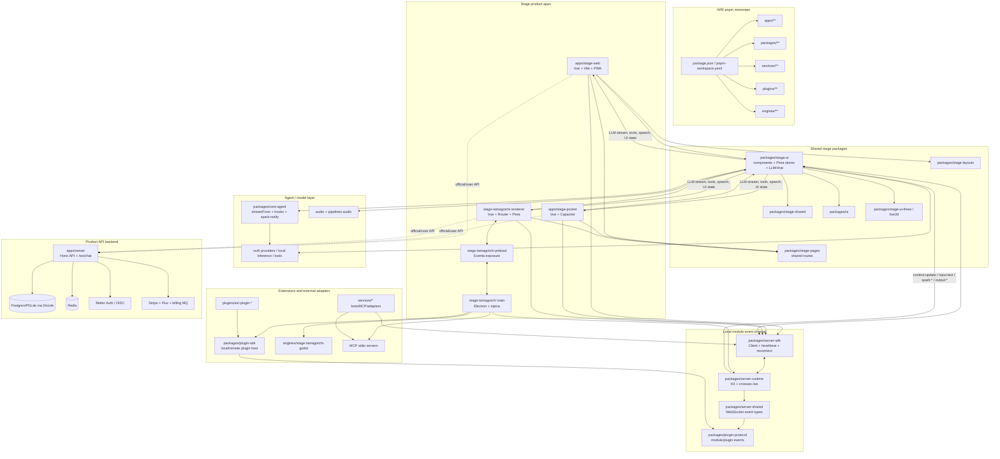

# Agent 1 아키텍처 분석 보고서 — AIRI 전체 시스템 구조

## 1. 분석 범위와 결론 요약

이 보고서는 `/workspace/airi` 저장소의 **전체 시스템 아키텍처**를 읽기 전용으로 분석한 결과다. 코드 수정은 하지 않았고, 산출물 파일만 `.agent_reviews/agent1_architecture.md`에 작성했다.

핵심 결론은 다음과 같다.

1. AIRI는 `pnpm` 워크스페이스 기반 모노레포이며, `apps/**`, `packages/**`, `plugins/**`, `services/**`, `integrations/**`, `engines/**`, `docs/**`를 하나의 제품/플랫폼 경계로 묶는다.
2. 사용자-facing 런타임은 크게 **Stage 계열 앱**(`stage-web`, `stage-tamagotchi`, `stage-pocket`), **클라우드/API 서버**(`apps/server`), **로컬/내장 WebSocket 런타임**(`packages/server-runtime`), **외부 서비스/플러그인**(`services`, `plugins`)으로 나뉜다.
3. 제품의 핵심 실행 흐름은 `stage-ui`의 Pinia store/composable이 담당한다. 앱별 entrypoint는 Vue/Router/Pinia/i18n/Tres를 부트스트랩하고, 공통 UI/상태/LLM/채팅/서버 채널 로직은 `packages/stage-ui`로 모인다.
4. 모듈 간 런타임 통신은 `@proj-airi/server-runtime` + `@proj-airi/server-sdk` + `@proj-airi/server-shared` + `@proj-airi/plugin-protocol` 조합의 WebSocket 이벤트 프로토콜이 중심이다. 기본 서버 URL은 `ws://localhost:6121/ws`이며, 이벤트는 `module:*`, `context:update`, `input:*`, `spark:*`, `output:*` 계열로 라우팅된다.
5. Electron 데스크톱 앱(`stage-tamagotchi`)은 별도의 main/preload/renderer 구조를 가지며, `injeca` DI로 창, 내장 서버, 플러그인 호스트, MCP stdio 서버, Godot stage, tray, auto updater 등을 조립한다.
6. 클라우드/API 서버(`apps/server`)는 Hono 기반 HTTP/WebSocket API로, Better Auth/DB/Redis/Stripe/Billing/Flux/Provider/Character/Chat 서비스를 DI로 조립하고 `/api/v1/*`, `/ws/chat` 등을 제공한다. 이는 로컬 모듈 이벤트 버스인 `server-runtime`과 구분되는 제품 백엔드다.

## 2. 모노레포 구조

### 2.1 워크스페이스 경계

**증거**

- `pnpm-workspace.yaml` — `packages/**`, `plugins/**`, `integrations/**`, `services/**`, `examples/**`, `docs/**`, `engines/**`, `apps/**`를 워크스페이스 패키지로 선언한다.
- `package.json` — 루트 패키지명은 `@proj-airi/root`, 설명은 `LLM powered virtual character`, `packageManager`는 `pnpm@10.33.0`이다.
- `package.json` — 루트 스크립트는 `dev:web`, `dev:tamagotchi`, `dev:pocket:*`, `dev:server`, `build`, `typecheck`, `test:run`, `lint` 등 앱/패키지 전체를 대상으로 한다.

**추론**

AIRI는 단일 앱 저장소라기보다 “가상 캐릭터/디지털 컴패니언” 제품군을 구성하는 플랫폼형 모노레포다. Stage 앱들이 공통 패키지를 직접 workspace dependency로 참조하고, 서버/플러그인/서비스도 같은 프로토콜과 SDK를 공유한다.

### 2.2 `apps/` — 배포/실행 단위

| 경로 | 패키지 | 역할 |
|---|---|---|
| `apps/stage-web` | `@proj-airi/stage-web` | 브라우저/PWA용 Stage 앱. Vue, Vite, Router, Pinia, Tres, PWA 플러그인을 사용한다. |
| `apps/stage-tamagotchi` | `@proj-airi/stage-tamagotchi` | Electron 데스크톱 앱. main/preload/renderer, 다중 창, 내장 서버, MCP, 플러그인 호스트를 포함한다. |
| `apps/stage-pocket` | `@proj-airi/stage-pocket` | Capacitor 기반 모바일 Stage 앱. Web과 유사한 Vue/Vite entrypoint를 사용하고 iOS/Android live reload를 지원한다. |
| `apps/server` | `@proj-airi/server` | Hono 기반 API 서버. Auth, DB, Redis, Billing, Flux, Stripe, Chat/Character/Provider API를 제공한다. |
| `apps/ui-server-auth` | `@proj-airi/ui-server-auth` | 서버 인증 UI. |
| `apps/component-calling` | `@proj-airi/component-calling` | Realtime audio 관련 실험/앱 단위. |

**증거**

- `apps/stage-web/package.json` — `@proj-airi/stage-ui`, `stage-pages`, `stage-shared`, `server-sdk`, `i18n`, `stage-ui-three`, `stream-kit` 등에 의존한다.
- `apps/stage-tamagotchi/package.json` — Electron 관련 `electron-vite`, `electron-builder`, `@proj-airi/electron-*`, `@proj-airi/server-runtime`, `@proj-airi/plugin-sdk`, `@proj-airi/plugin-sdk-tamagotchi`를 포함한다.
- `apps/stage-pocket/package.json` — Capacitor Android/iOS와 `@proj-airi/cap-vite`를 사용하고, `stage-web`과 유사하게 `stage-ui`, `stage-pages`, `server-sdk`에 의존한다.
- `apps/server/src/app.ts:86-229` — Hono 앱을 구성하고 `/health`, `/`, `/api/v1/characters`, `/api/v1/providers`, `/api/v1/chats`, `/api/v1/openai`, `/api/v1/flux`, `/api/v1/stripe`, `/ws/chat`을 등록한다.

### 2.3 `packages/` — 공통 런타임/도메인/프레젠테이션 레이어

주요 패키지는 다음 계층으로 나눌 수 있다.

#### Stage UI 계층

| 경로 | 역할 |
|---|---|
| `packages/stage-ui` | Stage 제품의 핵심 UI, Pinia store, LLM/채팅/모듈/프로바이더 로직. |
| `packages/stage-pages` | Web/Electron/Pocket에서 재사용하는 file-based route page. |
| `packages/stage-layouts` | 공유 레이아웃. |
| `packages/stage-shared` | Stage 공통 유틸, 환경 판별, global shortcut, server-channel QR, WebGPU 등. |
| `packages/stage-ui-three` | Three.js/Tres 기반 3D scene 컴포넌트. |
| `packages/stage-ui-live2d` | Live2D scene 컴포넌트와 store. |
| `packages/ui` | Reka UI 기반 범용 primitive 컴포넌트. |
| `packages/ui-transitions`, `packages/ui-loading-screens` | 전환/로딩 UI. |

**증거**

- `packages/stage-ui/package.json` — 설명이 `Shared core for stage`이며 `@proj-airi/core-agent`, `server-sdk`, `stage-shared`, `stage-ui-three`, `stage-ui-live2d`, `pipelines-audio`, `@xsai/*`에 의존한다.
- `packages/stage-ui/src/components/index.ts:1-12` — `auth`, `data-pane`, `gadgets`, `graphics`, `layouts`, `markdown`, `menu`, `modules`, `physics`, `scenarios`, `widgets` 컴포넌트 범주를 export한다.
- `packages/stage-ui/src/stores/index.ts:1-12` — background, display-models, mcp, modules, providers, settings 등 핵심 store를 export한다.
- `packages/stage-ui/src/stores/modules/index.ts:1-9` — airi-card, consciousness, discord, gaming-factorio, gaming-minecraft, hearing, speech, twitter, vision 모듈 store를 export한다.

#### Agent/LLM 계층

| 경로 | 역할 |
|---|---|
| `packages/core-agent` | AIRI의 agent runtime orchestration. 메시지 정규화, stream orchestration, chat hooks, spark-notify agent를 제공한다. |
| `packages/core-character` | character pipeline orchestration. |
| `packages/pipelines-audio` | capture/VAD/encode/stream 등 오디오 파이프라인. |
| `packages/audio`, `packages/audio-pipelines-transcribe` | 오디오 처리/전사 유틸. |
| `packages/model-driver-*` | lipsync, MediaPipe 등 모델/모션 드라이버. |

**증거**

- `packages/core-agent/package.json` — 설명이 `Core agent runtime orchestration for AIRI`이며 `@xsai/*`, `server-sdk`, `server-shared`, `pipelines-audio`에 의존한다.
- `packages/core-agent/src/index.ts:1-40` — Agent ports, chat hooks, context registry, `streamFrom`, message/session types를 public API로 export한다.
- `packages/core-agent/src/runtime/llm-service.ts:164-220` — `streamFrom`이 model, provider, messages, options, tool resolver를 받아 streaming LLM 호출을 수행한다.
- `packages/core-agent/src/runtime/agent-hooks.ts:6-194` — chat lifecycle hook registry를 만든다.

#### Server/Protocol 계층

| 경로 | 역할 |
|---|---|
| `packages/server-runtime` | H3/crossws 기반 로컬 WebSocket 런타임. `/ws` 이벤트 게이트웨이, 인증, registry, routing, heartbeat, consumer delivery를 담당한다. |
| `packages/server-sdk` | 클라이언트 SDK. Stage 앱/서비스/플러그인이 WebSocket 서버에 연결하고 이벤트를 송수신한다. |
| `packages/server-shared` | server runtime/SDK가 공유하는 WebSocket event type, error, utility. |
| `packages/plugin-protocol` | 플러그인/모듈 lifecycle 및 이벤트 타입 정의. |
| `packages/plugin-sdk` | 로컬/원격 플러그인 host/runtime SDK, Eventa transport abstraction, permission/resource/tool registry. |
| `packages/plugin-sdk-tamagotchi` | 데스크톱 tamagotchi 전용 플러그인 DX helper. |

**증거**

- `packages/server-runtime/package.json` — 설명이 `Server runtime implementation for AIRI running in different environments`이고 `h3`, `crossws`, `superjson`을 사용한다.
- `packages/server-runtime/src/server/index.ts:86-99` — WebSocket server controller를 생성한다고 설명한다.
- `packages/server-runtime/src/server/index.ts:99-228` — `createServer`가 start/stop/restart/updateConfig/getConnectionHost를 반환한다.
- `packages/server-runtime/src/index.ts:236-260` — `setupApp`이 H3 app과 peer cleanup helper를 생성한다.
- `packages/server-runtime/src/index.ts:467-480` — WebSocket open 시 auth token 유무에 따라 authenticated 상태를 초기화한다.
- `packages/server-runtime/src/index.ts:548-624` — `module:authenticate`, `module:announce` 이벤트를 처리한다.
- `packages/server-runtime/src/index.ts:626-664` — `ui:configure` 이벤트를 대상 module의 `module:configure`로 전달한다.
- `packages/server-runtime/src/index.ts:666-715` — consumer 등록/해제를 처리한다.
- `packages/server-runtime/src/index.ts:727-819` — 이벤트를 consumer 또는 peer broadcast/target으로 라우팅한다.
- `packages/server-runtime/src/index.ts:880` — `/ws` 경로에 WebSocket handler를 등록한다.
- `packages/server-sdk/src/client.ts:113-177` — `Client`가 URL, token, identity, heartbeat, reconnect 옵션으로 WebSocket 연결을 관리한다.
- `packages/server-sdk/src/client.ts:150-152` — 기본 URL은 `ws://localhost:6121/ws`다.
- `packages/server-shared/src/types/websocket/events.ts:13-30` — WebSocket event envelope와 `WebSocketEvents` 타입을 정의한다.
- `packages/plugin-protocol/src/types/events.ts:19-58` — plugin/module identity 모델을 정의한다.
- `packages/plugin-protocol/src/types/events.ts:113-148` — runtime contribution(capabilities/providers/ui/hooks/resources)을 정의한다.
- `packages/plugin-sdk/src/plugin-host/core.ts:97-123` — 플러그인 host가 local/remote transport를 Eventa context로 묶는 구조를 설명한다.
- `packages/plugin-sdk/src/plugin-host/core.ts:125-208` — plugin lifecycle 절차를 주석으로 상세히 설명한다.

### 2.4 `services/` — 외부 플랫폼 adapter/봇/MCP 서비스

| 경로 | 패키지 | 역할 |
|---|---|---|
| `services/computer-use-mcp` | `@proj-airi/computer-use-mcp` | macOS desktop orchestration MCP service. |
| `services/discord-bot` | `@proj-airi/discord-bot` | Discord bot adapter. |
| `services/minecraft` | `@proj-airi/minecraft-bot` | LLM 기반 Minecraft bot. |
| `services/satori-bot` | `@proj-airi/satori-bot` | Satori protocol adapter. |
| `services/telegram-bot` | `@proj-airi/telegram-bot` | Telegram bot adapter. |
| `services/twitter-services` | `@proj-airi/twitter-services` | Twitter Services for MCP. |

**추론**

`services/`는 AIRI core를 직접 구성하기보다 외부 플랫폼에서 발생한 입력/상황/명령을 AIRI 이벤트 채널 또는 MCP 도구 형태로 연결하는 adapter 계층이다. 이는 `packages/server-sdk`, `plugin-protocol`, `stage-ui`의 context/input/spark event 처리 구조와 맞물린다.

### 2.5 `plugins/`, `engines/`, `integrations/`

| 영역 | 역할 |
|---|---|
| `plugins/airi-plugin-*` | AIRI plugin SDK/protocol 위에서 동작하는 기능 확장. Bilibili live chat, Claude Code, Chess, Home Assistant, Web Extension 등이 있다. |
| `engines/stage-tamagotchi-godot` | Godot-native desktop stage runtime engine. Electron stage와 별도 renderer/engine 경계로 연결된다. |
| `integrations/` | 배포/확장/도구 통합 workspace. 현재 최상위 패키지 목록에는 package.json이 없지만 pnpm workspace 범위에는 포함된다. |

**증거**

- `plugins/*/package.json` — 각 plugin이 `@proj-airi/airi-plugin-*` 패키지로 존재한다.
- `engines/stage-tamagotchi-godot/package.json` — 설명이 `Godot-native desktop stage runtime workspace engine for stage-tamagotchi`다.
- `apps/stage-tamagotchi/src/main/index.ts:139-145` — Godot stage manager와 MCP stdio manager를 DI provider로 등록한다.
- `apps/stage-tamagotchi/src/main/index.ts:152-155` — plugin host를 DI provider로 등록한다.

## 3. 앱별 부트스트랩 구조

### 3.1 `stage-web`

`apps/stage-web/src/main.ts`는 브라우저 Stage 앱의 entrypoint다.

**증거**

- `apps/stage-web/src/main.ts:28-37` — Pinia를 생성하고, 환경에 따라 hash history 또는 web history를 사용한다.
- `apps/stage-web/src/main.ts:48-56` — Vue app에 MotionPlugin, autoAnimate, router, pinia, i18n, Tres를 등록하고 `#app`에 mount한다.
- `apps/stage-web/vite.config.ts:68-76` — `server-sdk`, `i18n`, `stage-ui`, `stage-pages`, `stage-shared`, `stage-layouts`를 workspace source로 alias한다.
- `apps/stage-web/vite.config.ts:133-140` — route folder에 앱 자체 `src/pages`와 `packages/stage-pages/src/pages`를 함께 등록한다.
- `apps/stage-web/vite.config.ts:171-211` — PWA manifest와 Workbox 설정을 등록한다.
- `apps/stage-web/src/App.vue:83-104` — analytics, display models, card, chat session, server channel, context bridge, character orchestrator, settings/audio device, local inference preload를 mount 시 초기화한다.

**추론**

Web 앱은 제품 UI shell만 자체적으로 갖고, 대부분의 도메인 동작은 `stage-ui` store에서 가져온다. file-based route도 앱 전용 페이지와 공유 페이지를 합성한다.

### 3.2 `stage-tamagotchi` Electron

Electron 앱은 main/preload/renderer가 분리되어 있다.

**증거**

- `apps/stage-tamagotchi/electron.vite.config.ts:22-87` — main/preload build를 설정하고 preload entry로 `index`, `beat-sync`를 지정한다.
- `apps/stage-tamagotchi/electron.vite.config.ts:89-145` — renderer build input, optimizeDeps 제외, workspace alias를 설정한다.
- `apps/stage-tamagotchi/electron.vite.config.ts:175-190` — renderer에 `import.meta.env.RUNTIME_ENVIRONMENT = 'electron'`, URL mode(server/file)를 define한다.
- `apps/stage-tamagotchi/electron.vite.config.ts:207-225` — renderer route folder에 공유 `stage-pages`와 앱 자체 renderer pages를 함께 등록하고 일부 공유 settings/devtools route를 제외한다.
- `apps/stage-tamagotchi/src/main/index.ts:95-123` — app ready 후 file logger, injeca logger, app config, auto updater를 등록한다.
- `apps/stage-tamagotchi/src/main/index.ts:130-155` — server channel, 내장 HTTP server, Godot stage manager, MCP stdio manager, widgets manager, plugin host를 등록한다.
- `apps/stage-tamagotchi/src/main/index.ts:159-202` — beat-sync, devtools, onboarding, notice, about, chat, settings, main, caption, tray 창/서비스를 등록한다.
- `apps/stage-tamagotchi/src/main/index.ts:204-218` — desktop overlay는 `AIRI_DESKTOP_OVERLAY=1` gate로 별도 provider를 eager build한다.
- `apps/stage-tamagotchi/src/main/index.ts:220-232` — mainWindow, tray, serverChannel, airiHttpServer, godotStageManager, pluginHost, mcpStdioManager 등을 invoke한 뒤 `injeca.start()`를 실행한다.
- `apps/stage-tamagotchi/src/preload/index.ts:1-3` — preload는 `shared.expose()`를 호출한다.
- `apps/stage-tamagotchi/src/renderer/main.ts:38-54` — renderer도 Web과 유사하게 Vue/Pinia/Router/i18n/Tres를 mount한다.
- `apps/stage-tamagotchi/src/renderer/App.vue:80-97` — Electron Eventa context/invoke를 통해 server channel config, plugin host, MCP tools, Godot status, artistry config 등을 bridge한다.
- `apps/stage-tamagotchi/src/renderer/App.vue:219-232` — Electron main에서 server channel config를 받아 `useModsServerChannelStore().initialize(...)` 후 context bridge와 character orchestrator를 초기화한다.
- `apps/stage-tamagotchi/src/shared/eventa/index.ts:21-39` — Electron window/server-channel Eventa invoke/event contract를 정의한다.
- `apps/stage-tamagotchi/src/shared/eventa/index.ts:178-220` — MCP stdio config/status/tool descriptor/call payload 타입을 정의한다.

**추론**

데스크톱 앱은 Stage UI runtime을 렌더러에서 실행하되, OS 권한/창/내장 서버/플러그인/MCP/Godot 같은 native 경계는 main process에서 관리한다. renderer와 main 사이의 타입 안전 IPC는 Eventa contract로 분리된다.

### 3.3 `stage-pocket`

**증거**

- `apps/stage-pocket/src/main.ts:28-60` — Web과 거의 같은 Vue/Pinia/Router/i18n/Tres 부트스트랩을 수행한다.
- `apps/stage-pocket/vite.config.ts:66-74` — `server-sdk`, `i18n`, `stage-ui`, `stage-layouts`, `stage-pages`, `stage-shared`를 workspace source로 alias한다.
- `apps/stage-pocket/vite.config.ts:76-93` — dev server host/port와 workspace warmup을 설정한다.
- `apps/stage-pocket/vite.config.ts:177-207` — Capacitor sync hook과 `RUNTIME_ENVIRONMENT = 'capacitor'` define을 설정한다.

**추론**

Pocket은 Web Stage shell을 모바일 Capacitor 환경에 맞게 포장한 구조다. 공통 `stage-ui`/`stage-pages` 의존성이 동일하므로 제품 기능 구현 대부분은 Web/Pocket/Electron renderer 간 공유된다.

### 3.4 `apps/server` API 서버

**증거**

- `apps/server/src/bin/run.ts:13-24` — CLI role은 `api`와 `billing-consumer`다.
- `apps/server/src/app.ts:86-229` — Hono app과 HTTP/WebSocket route를 구성한다.
- `apps/server/src/app.ts:113-131` — `/ws/chat`은 token query를 인증한 뒤 chat WebSocket handler로 업그레이드한다.
- `apps/server/src/app.ts:234-310` — logger, OpenTelemetry, DB, Redis를 injeca provider로 등록한다.
- `apps/server/src/app.ts:312-436` — config KV, billing MQ, email, characters, providers, chats, stripe, flux, user deletion, auth, request log, billing, TTS meter를 DI로 조립한다.
- `apps/server/src/app.ts:438-485` — `injeca.start()` 후 app dependencies를 resolve하고 `buildApp`으로 Hono app을 만든다.
- `apps/server/src/app.ts:491-495` — `serve`로 Hono app을 띄우고 WebSocket을 주입한다.

**추론**

`apps/server`는 사용자 계정/결제/공식 provider/채팅 persistence/API를 담당하는 백엔드이고, `packages/server-runtime`은 로컬 모듈/플러그인 간 이벤트 버스다. 둘 다 WebSocket을 쓰지만 역할과 프로토콜 경계가 다르다.

## 4. 런타임 데이터 흐름

### 4.1 Stage 앱 내부 채팅/LLM 흐름

1. 앱 entrypoint가 Vue/Pinia/router/i18n/Tres를 mount한다.
2. `App.vue` mount 단계에서 `chatSessionStore`, `serverChannelStore`, `contextBridgeStore`, `characterOrchestratorStore`, provider/settings/display model store를 초기화한다.
3. 사용자의 텍스트 입력 또는 외부 `input:text` 이벤트는 `useChatOrchestratorStore().ingest(...)`로 들어간다.
4. chat orchestrator는 현재 session messages, context store snapshot, time prefix, attachment를 조합해 provider용 `Message[]`를 만든다.
5. `useLLM().stream(...)`이 `@proj-airi/core-agent`의 `streamFrom(...)`을 호출한다.
6. `streamFrom(...)`은 xsAI `streamText` 기반으로 text delta/tool call/tool result/finish/error event를 방출한다.
7. chat store는 delta를 parser/categorizer에 넣고 UI streaming message, speech-oriented slices, tool result, final assistant message를 session에 반영한다.
8. context bridge는 assistant message/complete event를 `output:gen-ai:chat:*` 이벤트로 server channel에 보낸다.

**증거**

- `apps/stage-web/src/App.vue:83-104` — mount 시 Stage 핵심 store를 초기화한다.
- `apps/stage-tamagotchi/src/renderer/App.vue:200-250` — Electron renderer도 같은 핵심 store와 server channel/context bridge/orchestrator를 초기화한다.
- `packages/stage-ui/src/stores/chat.ts:108-127` — chat orchestrator store가 LLM, consciousness, session, stream, context, hooks를 묶는다.
- `packages/stage-ui/src/stores/chat.ts:160-257` — user message/attachment/input event를 session에 추가하고 context snapshot을 준비한다.
- `packages/stage-ui/src/stores/chat.ts:340-420` — per-message datetime prefix와 context prompt를 provider message에 합성한다.
- `packages/stage-ui/src/stores/chat.ts:440-509` — `llmStore.stream(...)`의 stream event를 tool/text/reasoning/error로 처리한다.
- `packages/stage-ui/src/stores/chat.ts:518-533` — parser 종료 후 assistant message를 session에 추가하고 lifecycle hooks를 emit한다.
- `packages/stage-ui/src/stores/llm.ts:36-80` — LLM store가 MCP/debug/spark command/runtime tools를 합쳐 `coreStreamFrom`을 호출한다.
- `packages/core-agent/src/runtime/llm-service.ts:164-220` — core streamFrom이 provider stream event를 실행한다.

### 4.2 Server channel / module event 흐름

1. Stage 앱 또는 서비스/플러그인이 `@proj-airi/server-sdk`의 `Client`로 `ws://localhost:6121/ws`에 연결한다.
2. SDK는 token, identity, possibleEvents, heartbeat, reconnect를 관리한다.
3. `server-runtime`은 `/ws`에서 peer를 등록하고, auth token 설정에 따라 인증 이벤트를 요구한다.
4. 모듈은 `module:authenticate` 후 `module:announce`로 이름/index/identity를 등록한다.
5. 서버는 registry sync/announced/de-announced/health event를 다른 authenticated peer에게 전파한다.
6. 일반 이벤트는 route/destination/delivery policy에 따라 broadcast, target, consumer/consumer-group 중 하나로 전달된다.
7. `context:update`, `input:text`, `spark:notify`, `spark:command`, `output:gen-ai:chat:*` 등이 이 버스를 통과한다.

**증거**

- `packages/stage-ui/src/stores/mods/api/channel-server.ts:60-63` — 기본 WebSocket URL과 auth token이 local storage setting으로 관리된다.
- `packages/stage-ui/src/stores/mods/api/channel-server.ts:66-86` — Stage client가 관심 event 목록을 선언한다.
- `packages/stage-ui/src/stores/mods/api/channel-server.ts:90-121` — SDK `Client`를 생성하고 possibleEvents/heartbeat를 설정한다.
- `packages/stage-ui/src/stores/mods/api/channel-server.ts:159-181` — ready 시 pending send flush, listener 초기화, reconnect callback 실행을 한다.
- `packages/stage-ui/src/stores/mods/api/channel-server.ts:261-280` — 연결 전 이벤트는 queue에 넣고 연결 후 flush한다.
- `packages/server-runtime/src/server/index.ts:99-228` — server controller가 H3/crossws server를 시작한다.
- `packages/server-runtime/src/index.ts:467-480` — WebSocket open 시 peer/auth 상태를 등록한다.
- `packages/server-runtime/src/index.ts:548-624` — 인증과 module announce 처리.
- `packages/server-runtime/src/index.ts:666-715` — consumer 등록/해제.
- `packages/server-runtime/src/index.ts:727-819` — 이벤트 라우팅과 broadcast/consumer delivery.
- `packages/server-runtime/src/index.ts:880` — `/ws` handler mount.

### 4.3 외부 입력 → AIRI 반응 → 외부 출력 흐름

1. 외부 서비스/플러그인/모듈이 `input:text` 또는 `context:update` 이벤트를 server channel로 보낸다.
2. Stage 앱의 context bridge는 consumer-group `chat-ingestion`으로 `input:text`, `input:text:voice`, `input:voice` 처리를 등록한다.
3. `input:text` 이벤트가 오면 context updates를 chat context store에 반영하고, active provider/model이 있으면 chat orchestrator에 ingestion을 요청한다.
4. LLM streaming 결과는 assistant UI/session에 반영되고, `output:gen-ai:chat:message`, `output:gen-ai:chat:complete` 이벤트로 다시 channel에 발행된다.

**증거**

- `packages/stage-ui/src/stores/mods/api/context-bridge.ts:174-197` — 초기화 시 consumer event들을 `module:consumer:register`로 등록한다.
- `packages/stage-ui/src/stores/mods/api/context-bridge.ts:334-395` — `input:text`의 contextUpdates를 정규화하고 chat context에 ingest한다.
- `packages/stage-ui/src/stores/mods/api/context-bridge.ts:397-456` — active provider/model을 확인한 뒤 lock 안에서 `chatOrchestrator.ingest(...)`를 실행한다.
- `packages/stage-ui/src/stores/mods/api/context-bridge.ts:510-535` — assistant message/complete를 `output:gen-ai:chat:*` 이벤트로 전송한다.

### 4.4 `spark:notify` / autonomous command 흐름

1. 외부 모듈 또는 내부 scheduler가 `spark:notify` 이벤트를 발행한다.
2. `useCharacterOrchestratorStore`가 event를 즉시 처리하거나 urgency/attempt 정책에 따라 queue에 넣는다.
3. `@proj-airi/core-agent`의 spark notify agent가 provider/model/tools를 사용해 reaction text 또는 `spark:command`를 생성한다.
4. reaction은 character store를 통해 speech runtime intent로 연결되고, command는 server channel에 `spark:command`로 발행된다.

**증거**

- `packages/stage-ui/src/stores/character/orchestrator/store.ts:81-127` — `spark:notify` queue/즉시 처리 로직.
- `packages/stage-ui/src/stores/character/orchestrator/store.ts:105-117` — notify 결과의 command를 `spark:command` 이벤트로 전송한다.
- `packages/stage-ui/src/stores/character/orchestrator/store.ts:144-170` — due task를 `spark:notify` 이벤트로 만든다.
- `packages/stage-ui/src/stores/character/orchestrator/store.ts:228-256` — `spark:notify`, `spark:emit` listener 등록과 ticker 시작.
- `packages/stage-ui/src/stores/character/index.ts:71-120` — streaming reaction chunk/end를 speech intent와 reaction history에 반영한다.
- `packages/core-agent/src/agents/spark-notify/handler.ts:24-68` — spark notify response/command/result 타입을 정의한다.
- `packages/core-agent/src/agents/spark-notify/handler.ts:168-198` — spark notify payload를 provider user message로 직렬화한다.
- `packages/core-agent/src/agents/spark-notify/handler.ts:330-351` — runtime이 `spark:notify` event를 소비하는 handler를 만든다.

### 4.5 Electron main/native 흐름

1. Electron main process가 OS/desktop 기능과 런타임 서비스를 DI provider로 등록한다.
2. Renderer는 Eventa invoke/event contract를 통해 main process 기능을 호출한다.
3. 내장 server channel/http server/plugin host/MCP/Godot/window manager가 main process에서 실행되고, renderer는 설정/도구/상태를 bridge로 동기화한다.

**증거**

- `apps/stage-tamagotchi/src/main/index.ts:21-47` — main process가 debugger/config/lifecycle/service/window setup 함수를 import한다.
- `apps/stage-tamagotchi/src/main/index.ts:130-155` — server channel, built-in server, Godot, MCP, widgets, plugin host provider.
- `apps/stage-tamagotchi/src/main/index.ts:179-202` — chat/settings/main/caption/tray 창 provider.
- `apps/stage-tamagotchi/src/main/index.ts:220-232` — 전체 provider graph invoke 후 `injeca.start()`.
- `apps/stage-tamagotchi/src/shared/eventa/index.ts:21-39` — renderer-main server channel/window Eventa contract.
- `apps/stage-tamagotchi/src/renderer/App.vue:80-97` — renderer에서 Electron Eventa invoke를 생성한다.

## 5. Mermaid 전체 아키텍처 다이어그램

## 6. 핵심 디렉터리/파일 색인과 증거 경로

### 저장소/빌드

- `pnpm-workspace.yaml` — workspace package scope, catalog, overrides, patched dependencies.
- `package.json` — root scripts: dev/build/test/typecheck/lint, package manager, monorepo workspaces.
- `turbo.json` — turbo build orchestration 경계.
- `eslint.config.js`, `vitest.config.ts`, `uno.config.ts` — lint/test/style 전역 설정.

### Stage 앱

- `apps/stage-web/src/main.ts` — Web app entrypoint.
- `apps/stage-web/src/App.vue` — Web runtime store initialization.
- `apps/stage-web/vite.config.ts` — workspace alias, shared routes/layouts, PWA.
- `apps/stage-pocket/src/main.ts` — Pocket app entrypoint.
- `apps/stage-pocket/vite.config.ts` — Capacitor/Vite integration.
- `apps/stage-tamagotchi/src/main/index.ts` — Electron main DI composition.
- `apps/stage-tamagotchi/src/preload/index.ts` — preload exposure entry.
- `apps/stage-tamagotchi/src/renderer/main.ts` — Electron renderer Vue bootstrap.
- `apps/stage-tamagotchi/src/renderer/App.vue` — Electron renderer runtime bridge/store initialization.
- `apps/stage-tamagotchi/src/shared/eventa/index.ts` — typed IPC/Eventa contracts.
- `apps/stage-tamagotchi/electron.vite.config.ts` — Electron main/preload/renderer build and route composition.

### Shared Stage domain

- `packages/stage-ui/src/stores/chat.ts` — chat orchestration, message composition, streaming updates, hooks.
- `packages/stage-ui/src/stores/llm.ts` — LLM provider streaming wrapper and built-in tool resolver.
- `packages/stage-ui/src/stores/providers.ts` — provider metadata/config/capability/validation store.
- `packages/stage-ui/src/stores/mods/api/channel-server.ts` — WebSocket server channel client store.
- `packages/stage-ui/src/stores/mods/api/context-bridge.ts` — context/input/output bridge between server channel and chat orchestrator.
- `packages/stage-ui/src/stores/character/index.ts` — character reaction/speech output state.
- `packages/stage-ui/src/stores/character/orchestrator/store.ts` — `spark:notify` scheduling/processing.
- `packages/stage-ui/src/stores/modules/index.ts` — AIRI modules export map.
- `packages/stage-ui/src/components/index.ts` — shared component export map.
- `packages/stage-pages/src/pages/**` — shared route pages.
- `packages/stage-layouts/src/layouts/**` — shared route layouts.

### Agent/model runtime

- `packages/core-agent/src/index.ts` — public exports.
- `packages/core-agent/src/runtime/llm-service.ts` — `streamFrom`, message sanitization, tool/content-array compatibility degrade.
- `packages/core-agent/src/runtime/agent-hooks.ts` — chat lifecycle hook registry.
- `packages/core-agent/src/agents/spark-notify/handler.ts` — spark notify agent and command expansion.
- `packages/core-agent/src/contracts/*.ts` — LLM/session/context/stream port contracts.

### Local event channel / plugin protocol

- `packages/server-runtime/src/bin/run.ts` — standalone server-runtime CLI entry.
- `packages/server-runtime/src/server/index.ts` — server lifecycle controller.
- `packages/server-runtime/src/index.ts` — H3 WebSocket app, auth, registry, routing, heartbeat, consumer delivery.
- `packages/server-runtime/src/server-ws/airi/index.ts` — AIRI event parsing/stringifying/delivery helper.
- `packages/server-runtime/src/server-ws/core/index.ts` — generic WS delivery/peer orchestration primitives.
- `packages/server-sdk/src/client.ts` — client connection/auth/announce/send/listen/reconnect.
- `packages/server-sdk/src/index.ts` — SDK exports and shared type re-exports.
- `packages/server-shared/src/types/websocket/events.ts` — event envelope and event map.
- `packages/plugin-protocol/src/types/events.ts` — plugin/module lifecycle event types.
- `packages/plugin-sdk/src/plugin-host/core.ts` — plugin host lifecycle/state machine/transport model.

### Product API backend

- `apps/server/src/bin/run.ts` — API vs billing-consumer CLI role dispatch.
- `apps/server/src/app.ts` — DI graph, Hono routes, `/ws/chat`, DB/Redis/Auth/Billing wiring.
- `apps/server/src/routes/**` — auth, characters, chats, providers, flux, stripe, openai routes.
- `apps/server/src/services/**` — business services.
- `apps/server/src/schemas/**` — Drizzle schema.
- `apps/server/src/libs/**` — auth, DB, env, Redis, MQ, OpenTelemetry, request auth.

### External adapters / plugins / engines

- `services/*/package.json` — Discord/Telegram/Satori/Minecraft/Twitter/MCP services.
- `plugins/*/package.json` — AIRI plugin packages.
- `packages/plugin-sdk/src/**` — plugin host/runtime SDK.
- `engines/stage-tamagotchi-godot/**` — Godot stage runtime.
- `apps/stage-tamagotchi/src/main/services/airi/mcp-servers/index.ts` — Electron-side MCP stdio manager.
- `apps/stage-tamagotchi/src/main/services/airi/plugins/index.ts` — Electron-side plugin host integration.

## 7. 아키텍처 해석: evidence / inference / unknown

### Evidence

- Workspace scope는 `pnpm-workspace.yaml`에 직접 선언되어 있다.
- Stage Web/Pocket/Tamagotchi renderer는 모두 Vue + Pinia + Router + i18n + Tres를 mount한다.
- `stage-ui`는 store/component/lib export와 dependency상 Stage 앱의 공통 핵심 레이어다.
- `server-runtime`은 `/ws` WebSocket endpoint를 제공하고 module auth/announce/registry/routing/consumer delivery를 구현한다.
- `server-sdk`는 `ws://localhost:6121/ws` 기본 URL을 갖는 reconnect/heartbeat client다.
- Electron main은 `injeca`로 native/window/server/plugin/MCP/Godot 서비스를 조립한다.
- `apps/server`는 Hono API 서버로 DB/Redis/Auth/Billing/Flux/Stripe/Chat/Character/Provider 서비스를 조립한다.

### Inference

- AIRI의 중심 아키텍처는 “공유 Stage runtime + 로컬 이벤트 버스 + 플러그인/서비스 확장 + 선택적 클라우드 API” 구조다.
- Stage 앱들은 UI shell과 platform bridge만 다르고, 채팅/LLM/context/spark/provider/module 로직은 `stage-ui`로 최대한 공유한다.
- `server-runtime`과 `apps/server`는 모두 서버 성격이 있지만, 전자는 로컬/모듈 이벤트 라우터, 후자는 계정/결제/공식 API 백엔드로 역할이 분리되어 있다.
- `spark:notify`와 `spark:command`는 AIRI의 autonomous reaction/command plane이고, `input:text`/`output:gen-ai:chat:*`는 외부 입력과 LLM 응답을 연결하는 I/O plane이다.

### Unknown / limits

- 이 분석은 정적 파일 근거에 기반한다. 실제 배포 구성, production env, 외부 서비스 credential, 운영 중인 server-runtime topology는 저장소만으로 완전히 확정할 수 없다.
- `integrations/`는 workspace 범위에 포함되지만, 현재 상위 package.json 목록 기준으로는 구체적 런타임 패키지 역할이 명확하지 않다.
- `services/*`가 실제로 어떤 이벤트/SDK 경로로 연결되는지는 각 service 내부 구현을 더 추적해야 정확히 확정할 수 있다. 본 보고서에서는 package description과 공통 server-sdk/protocol 구조를 근거로 adapter 계층이라고 해석했다.

## 8. 검증 상태

- 읽기 명령으로 저장소 구조, package metadata, 주요 entrypoint, store, protocol/server 파일을 확인했다.
- `omx explore`는 시도했지만 현재 환경에 `cargo`가 없어 실행되지 않았다. 이후 일반 shell read-only 명령(`find`, `sed`, `nl`, `grep`, `node` package metadata scan)으로 대체했다.
- 코드 파일은 수정하지 않았다. 생성/수정한 파일은 요청된 보고서 `.agent_reviews/agent1_architecture.md`뿐이다.
