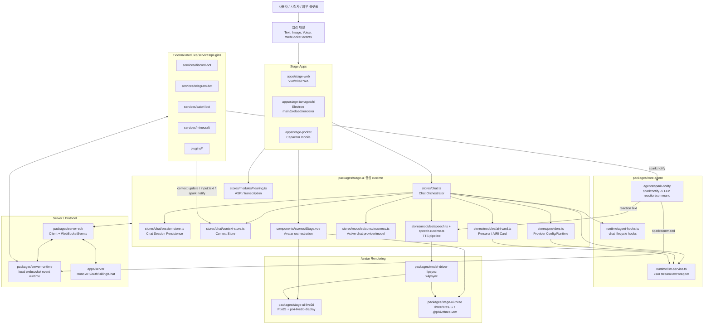
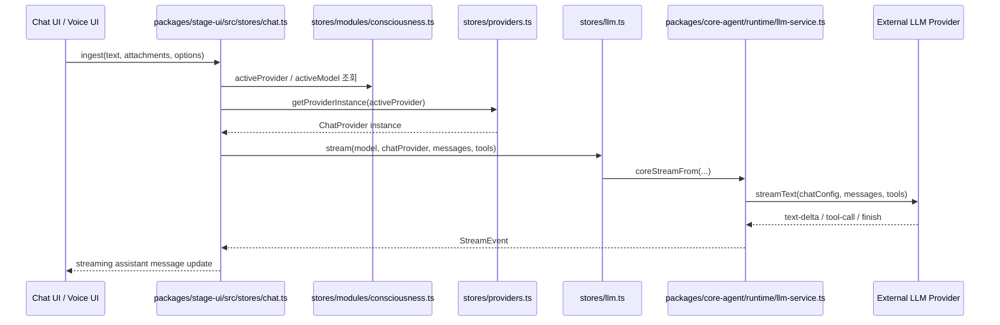
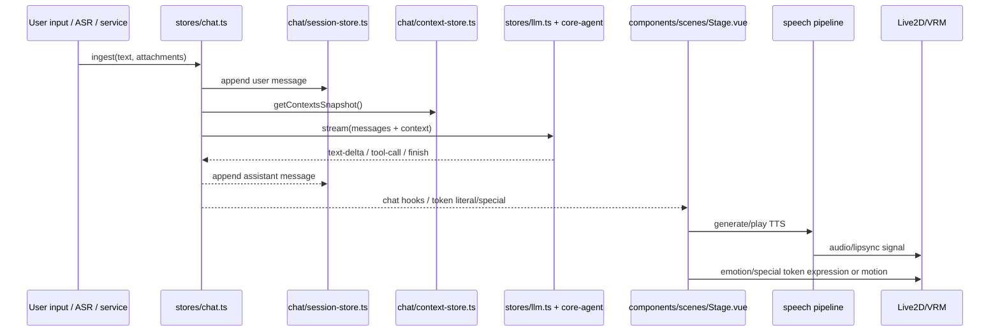

# AIRI 코드베이스 분석

> 대상 저장소: `https://github.com/SebinLee/airi`  
> 로컬 경로: `/workspace/airi`  
> 목적: AI VTuber / virtual character AIRI의 소스코드 구조와 핵심 동작 경로를 코드 기준으로 설명하기 위한 분석 자료

## 0. 분석 방법 및 주의사항

- 요청대로 로컬 `omx ralph` 기반으로 5개 독립 분석 작업을 수행했고, 각 Agent 산출물은 `.agent_reviews/agent{1..5}_*.md`에 저장했다.
- `omx ralph --model opus`는 현재 Codex/OMX 환경에서 `"opus" is not a supported model` 오류로 실패했다. 이후 동일한 `omx ralph` workflow를 유지하되, 현재 환경에서 동작 가능한 Codex 모델로 5개 Agent를 실행했다. 따라서 본 문서의 내용은 **OMX/Ralph 기반 멀티 에이전트 분석 결과 + 직접 코드 확인**을 종합한 것이다.
- 이 분석은 “기능이 코드에서 어떻게 동작하는지”를 설명하는 데 초점을 두며, 문서/README만이 아니라 실제 runtime store, component, provider registry, websocket/event flow 파일을 근거로 했다.

---

## 1. 전반적인 System Architecture

### 1.1 High-level overview

AIRI는 단일 프론트엔드 앱이라기보다, **AI virtual character / AI VTuber 플랫폼형 monorepo**다. 핵심 구조는 다음과 같이 나뉜다.

1. **Stage 앱 계층**
   - `apps/stage-web`: 브라우저/PWA용 Stage 앱.
   - `apps/stage-tamagotchi`: Electron 데스크톱 앱. 현재 데스크톱 주력 앱이다.
   - `apps/stage-pocket`: Capacitor 기반 모바일 앱.
2. **공통 UI/상태/LLM orchestration 계층**
   - `packages/stage-ui`: 채팅, provider 설정, persona card, hearing/speech, stage scene orchestration 등 핵심 runtime store.
   - `packages/stage-pages`: Web/Electron/Pocket이 공유하는 설정/페이지 컴포넌트.
   - `packages/stage-ui-live2d`: 2D Live2D renderer.
   - `packages/stage-ui-three`: 3D VRM renderer.
   - `packages/core-agent`: LLM streaming, message normalization, chat hooks, `spark:notify` agent runtime.
3. **Server / protocol 계층**
   - `packages/server-runtime`: 로컬 WebSocket event runtime.
   - `packages/server-sdk`: Stage 앱과 모듈/서비스가 공유하는 WebSocket client/event type.
   - `apps/server`: Hono 기반 API 서버. Auth, Stripe/Billing, provider API, chat API 등 제품 백엔드 성격.
4. **외부 서비스/플러그인 계층**
   - `services/*`: Discord/Telegram/Satori/Minecraft/Twitter 등 외부 서비스 bridge.
   - `plugins/*`: AIRI plugin packages. 예: Claude Code plugin, Bilibili Laplace plugin, HomeAssistant 등.
   - `packages/plugin-*`: 플러그인 protocol/SDK.
5. **모델/오디오/미디어 계층**
   - `packages/pipelines-audio`, `packages/model-driver-lipsync`, `packages/model-driver-mediapipe`, `packages/audio*`.

### 1.2 System Architecture Diagram



### 1.3 주요 directory / file 역할

| 경로 | 역할 |
|---|---|
| `pnpm-workspace.yaml` | `packages/**`, `plugins/**`, `integrations/**`, `services/**`, `docs/**`, `engines/**`, `apps/**`를 workspace로 묶는다. |
| `apps/stage-web` | Web/PWA stage 앱. Vue, Vite, Pinia, Router 기반. |
| `apps/stage-tamagotchi` | Electron desktop 앱. renderer/main/preload, 내장 서버, 플러그인 호스트, overlay/caption 등 desktop 특화 기능. |
| `apps/stage-pocket` | Capacitor mobile 앱. |
| `apps/server` | Hono 기반 서버. `/api/v1/*`, `/ws/chat`, auth/billing/provider/chat API. |
| `packages/stage-ui` | AIRI stage runtime의 중심. 채팅, provider, settings, module store, stage scene, speech/hearing 등. |
| `packages/stage-pages` | 앱 간 공유 설정/페이지 UI. |
| `packages/core-agent` | LLM stream, chat hooks, spark notify agent 등 agent runtime. |
| `packages/server-sdk`, `packages/server-runtime` | WebSocket event protocol과 runtime. |
| `packages/stage-ui-live2d` | 2D Live2D renderer. |
| `packages/stage-ui-three` | 3D VRM renderer. |
| `services/*` | Discord/Telegram/Satori/Minecraft/Twitter 등 외부 서비스 bridge. |
| `plugins/*` | AIRI plugin packages. |

---

## 2. AI Provider 변경 가능 여부

### 2.1 High-level overview

결론부터 말하면, **Grok/xAI만 사용하는 구조가 아니다.** AIRI는 provider registry와 Pinia runtime store를 통해 다양한 LLM provider를 선택할 수 있도록 설계되어 있다.

현재 코드에서 확인되는 chat LLM provider 예시는 다음과 같다.

- OpenAI
- Anthropic / Claude
- Google Gemini
- xAI / Grok 계열
- Groq
- OpenRouter
- Ollama
- DeepSeek
- Mistral
- Perplexity
- Together
- Fireworks
- Cerebras
- NVIDIA
- LM Studio
- OpenAI-compatible endpoint
- Azure OpenAI / Azure AI Foundry 등

즉 “Grok 이외 타 LLM 사용 가능 여부”는 **가능**이다. 이미 registry에 다수 provider가 들어 있다.

### 2.2 Provider 구조

#### Definition registry 계층

| 파일 | 역할 |
|---|---|
| `packages/stage-ui/src/libs/providers/providers/registry.ts` | `providerRegistry` Map, `defineProvider()`, `listProviders()`, `getDefinedProvider()` 제공. |
| `packages/stage-ui/src/libs/providers/providers/index.ts` | 각 provider module을 import하여 registry에 등록한다. 새 provider를 추가하면 여기에 import가 필요하다. |
| `packages/stage-ui/src/libs/providers/types.ts` | `ProviderDefinition`, model/voice/validator 관련 타입 정의. |
| `packages/stage-ui/src/libs/providers/providers/xai/index.ts` | xAI/Grok provider. 기본 base URL은 `https://api.x.ai/v1/`. |
| `packages/stage-ui/src/libs/providers/providers/groq/index.ts` | GroqCloud provider. xAI/Grok와 별개. 기본 base URL은 `https://api.groq.com/openai/v1/`. |
| `packages/stage-ui/src/libs/providers/providers/openrouter-ai/index.ts` | OpenRouter provider. |

#### Runtime/settings 계층

| 파일 | 역할 |
|---|---|
| `packages/stage-ui/src/stores/providers.ts` | 사용자 credentials/config 저장, provider validation, model listing, provider instance 생성. |
| `packages/stage-ui/src/stores/providers/converters.ts` | `ProviderDefinition`을 기존 `ProviderMetadata` 형태로 변환. |
| `packages/stage-ui/src/stores/modules/consciousness.ts` | 현재 사용 중인 chat provider/model 선택값 관리. 저장 key는 `settings/consciousness/active-provider`, `settings/consciousness/active-model`. |
| `packages/stage-ui/src/stores/llm.ts` | 실제 LLM stream 호출 wrapper. `coreStreamFrom()`을 통해 `packages/core-agent`의 stream runtime으로 이동. |
| `packages/core-agent/src/runtime/llm-service.ts` | `@xsai/stream-text`를 호출하는 최종 stream runtime. provider별 content-array/tool compatibility degrade도 처리. |

### 2.3 실제 채팅 호출 흐름



### 2.4 다른 LLM을 쓰려면 어디를 수정/설정해야 하나?

#### 이미 지원되는 provider를 쓰는 경우

코드 수정 없이 UI 설정에서 provider credential과 model을 설정하는 경로가 의도된 구조다.

확인할 주요 파일:

- Provider credential/runtime: `packages/stage-ui/src/stores/providers.ts`
- Active chat provider/model: `packages/stage-ui/src/stores/modules/consciousness.ts`
- Settings page: `packages/stage-pages/src/pages/settings/**` 및 provider 관련 scenario components

#### 새 provider를 추가하는 경우

새 provider를 코드에 추가하려면 보통 다음을 수정한다.

1. `packages/stage-ui/src/libs/providers/providers/<new-provider>/index.ts`
   - `defineProvider({ id, name, category, fields, createProvider, capabilities ... })` 형태로 provider definition 추가.
2. `packages/stage-ui/src/libs/providers/providers/index.ts`
   - 새 provider module import 추가.
3. 필요 시 validator/list-models 구현
   - `packages/stage-ui/src/libs/providers/validators/*`
   - 또는 provider definition의 `extraMethods.listModels`.
4. 필요 시 config schema/default 추가
   - `packages/stage-ui/src/libs/providers/types.ts`와 provider-specific schema.
5. UI 번역/label 추가가 필요하면 `packages/i18n` 및 provider settings UI 확인.

#### OpenAI-compatible endpoint를 쓰는 경우

대부분의 provider는 OpenAI-compatible adapter를 이용한다. 자체 provider를 만들지 않고도 `openai-compatible-*` 계열 provider 설정에서 base URL/API key/model을 지정하는 방향이 가장 낮은 비용이다.

---

## 3. Persona 설정 및 방송 중 콘텐츠 기반 Persona 업데이트 여부

### 3.1 High-level overview

AIRI의 persona는 주로 **AIRI Card**라는 character/profile 객체에 저장된다. 코드상 persona는 다음 속성들과 연결된다.

- name
- description
- personality
- scenario
- greetings
- system prompt
- modules/extensions 설정

핵심 결론:

1. **Persona 설정 기능은 있다.** `AIRI Card` store와 settings UI에서 관리한다.
2. **방송 중 콘텐츠 기반으로 persona 자체를 자동 수정하는 기능은 명확히 확인되지 않는다.**
3. 다만 외부 context나 broadcast content가 prompt에 붙어 응답에 영향을 주는 경로는 있다.
4. `spark:notify`의 `guidance.persona`는 downstream command용 일회성 persona hint이며, card의 `personality/systemPrompt`를 영구 수정하는 기능은 아니다.

### 3.2 Persona 관련 주요 파일

| 파일 | 역할 |
|---|---|
| `packages/stage-ui/src/stores/modules/airi-card.ts` | AIRI card 로드/저장/활성 card/systemPrompt 계산. |
| `packages/stage-ui/src/types/airi-card.ts` | AIRI card type. |
| `packages/stage-ui/src/stores/chat/session-store.ts` | active card의 `systemPrompt`로 새 chat session의 system message 생성. |
| `packages/stage-ui/src/stores/character/index.ts` | active card 기반 character store. spark notify reaction을 speech runtime으로 전달. |
| `packages/stage-pages/src/pages/settings/airi-card/**` | AIRI card 설정 UI. |
| `packages/stage-ui/src/stores/chat/context-store.ts` | 외부 context 저장/병합. persona 변경은 아니지만 응답 컨텍스트에 영향. |

### 3.3 System prompt 생성 흐름

`packages/stage-ui/src/stores/chat/session-store.ts`는 `useAiriCardStore()`의 `systemPrompt`를 가져와 session 초기 system message를 만든다.

흐름:

```mermaid
flowchart LR
  Card[AIRI Card\nname/personality/scenario/greetings] --> AiriCardStore[stores/modules/airi-card.ts\nsystemPrompt computed]
  AiriCardStore --> Session[chat/session-store.ts\ngenerateInitialMessage]
  Session --> ChatHistory[sessionMessages[sessionId]\nrole=system]
  ChatHistory --> LLM[stores/chat.ts -> stores/llm.ts\nprovider stream]
```

즉 persona 설정은 LLM에게 전달되는 system prompt에 반영된다.

### 3.4 방송/콘텐츠 기반 persona update 여부

확인된 관련 기능은 다음과 같이 구분된다.

#### 1) Context update: 있음

`context:update` event나 내부 context store를 통해 외부 상황이 prompt에 추가될 수 있다.

- `packages/stage-ui/src/stores/chat/context-store.ts`
- `packages/stage-ui/src/stores/mods/api/context-bridge.ts`
- `packages/stage-ui/src/stores/mods/api/channel-server.ts`
- `packages/stage-ui/src/stores/chat.ts`

`stores/chat.ts`는 `formatContextPromptText(contextsSnapshot)` 결과를 최신 user message 뒤에 붙인다. 따라서 외부 방송/게임/모듈 상태가 들어오면 persona 자체를 바꾸지는 않지만, **현재 답변의 컨텍스트**는 바뀐다.

#### 2) Spark notify: 있음

`spark:notify` event는 LLM에게 “어떤 외부 module이 AIRI에게 알림을 보냈다”는 형태로 전달된다.

- `packages/stage-ui/src/stores/character/orchestrator/store.ts`
- `packages/core-agent/src/agents/spark-notify/handler.ts`
- `packages/core-agent/src/agents/spark-notify/tools.ts`
- `packages/core-agent/src/agents/spark-notify/schema.ts`

LLM은 다음 중 하나를 할 수 있다.

- 텍스트 reaction 생성 → UI/TTS로 출력.
- `builtIn_sparkNoResponse` tool 호출 → 반응하지 않음.
- `builtIn_sparkCommand` tool 호출 → downstream agent/lane에 `spark:command` 전달.

`sparkNotifyCommandSchema`에는 `guidance.persona`가 있어 downstream command에 persona trait hint를 줄 수 있다. 그러나 이것은 card store를 수정하지 않는다.

#### 3) Persona 영구 업데이트: 확인되지 않음

다음 UI는 WIP로 보인다.

- `packages/stage-pages/src/pages/settings/memory/index.vue`
- `packages/stage-pages/src/pages/settings/modules/memory-long-term.vue`
- `packages/stage-pages/src/pages/settings/modules/memory-short-term.vue`

따라서 “방송 중 콘텐츠를 보고 character persona/personality를 자동으로 갱신하여 저장하는 기능”은 현재 코드 기준으로는 구현되어 있다고 보기 어렵다. 기능을 만들려면 다음 경로를 확장해야 한다.

- 콘텐츠/방송 이벤트 수집: `context:update`, `spark:notify`, platform service event.
- 분석 agent: `packages/core-agent` 또는 `packages/stage-ui/src/stores/character/orchestrator`.
- 영구 persona 저장: `packages/stage-ui/src/stores/modules/airi-card.ts`의 card update/save API.
- UI 확인/승인: `packages/stage-pages/src/pages/settings/airi-card/**`.

---

## 4. Chat, donation 등 사용자 interaction 수집 및 반응 방식

### 4.1 High-level overview

AIRI의 interaction은 크게 네 종류로 볼 수 있다.

1. **Stage 앱 내부 채팅 입력**
   - 텍스트, 이미지 첨부, 음성 ASR 결과.
2. **외부 service/platform 입력**
   - Discord, Telegram, Satori 계열 service, Minecraft/game module 등.
3. **Runtime context update**
   - 모듈이 현재 상황을 `context:update`로 제공.
4. **Spark notify / command**
   - 외부 모듈이 AIRI에게 즉시/나중에 확인할 event를 전달하고, AIRI가 reaction 또는 command로 응답.

Donation/superchat/cheer/bits/gift 같은 실시간 후원 event 수집 경로는 현재 코드에서 확인되지 않았다. Stripe/Billing은 존재하지만 이는 제품 결제/구독/크레딧 과금용으로 보이며, 방송 중 donation event reaction pipeline은 아니다.

### 4.2 Stage 앱 내부 chat 입력

#### Desktop text/image 입력

- 주요 UI: `apps/stage-tamagotchi/src/renderer/components/InteractiveArea.vue`
- 채팅 동기화 store: `apps/stage-tamagotchi/src/renderer/stores/chat-sync.ts`
- 핵심 orchestrator: `packages/stage-ui/src/stores/chat.ts`

Desktop의 renderer UI에서 텍스트와 이미지가 입력되면 `chatSyncStore.requestIngest(...)`를 통해 authority window가 실제 `chatOrchestrator.ingest(...)`를 수행한다. Electron 다중 window 구조 때문에 follower window는 BroadcastChannel로 authority window에 명령을 위임한다.

#### Web voice/text 입력

- 주요 page: `apps/stage-web/src/pages/index.vue`
- ASR store: `packages/stage-ui/src/stores/modules/hearing.ts`
- chat store: `packages/stage-ui/src/stores/chat.ts`

녹음/voice input은 ASR로 text 변환 후 동일한 `ingest` 경로로 들어간다.

### 4.3 Chat orchestrator 내부 처리

`packages/stage-ui/src/stores/chat.ts`가 핵심이다.

주요 단계:

1. `ingest(...)`가 send queue에 작업을 넣는다.
2. `performSend(...)`가 user message와 attachment를 session에 append한다.
3. context store snapshot을 가져와 최신 user message에 context prompt를 병합한다.
4. `llmStore.stream(...)`으로 provider stream을 실행한다.
5. stream event를 처리한다.
   - `text-delta`: assistant message content/slices 업데이트.
   - `reasoning-delta`: reasoning panel용 categorization 업데이트.
   - `tool-call`, `tool-result`, `tool-error`: assistant message slice/tool result에 반영.
6. stream 종료 후 assistant message를 session에 저장하고 chat lifecycle hooks를 호출한다.
7. Stage scene의 chat hooks가 TTS, caption, emotion token, lipsync, avatar expression에 연결된다.



### 4.4 Spark notify / external module 반응

외부 module은 WebSocket event로 `spark:notify`를 보낼 수 있다.

주요 파일:

| 파일 | 역할 |
|---|---|
| `packages/stage-ui/src/stores/mods/api/channel-server.ts` | Stage 앱이 `ws://localhost:6121/ws`에 연결하고 `spark:notify`, `context:update`, `input:text` 등 event를 주고받는다. |
| `packages/stage-ui/src/stores/character/orchestrator/store.ts` | `spark:notify` listener, queue/scheduler, immediate/soon/later 처리. |
| `packages/core-agent/src/agents/spark-notify/handler.ts` | LLM에게 notify event를 system/user message로 렌더링하고 reaction/command 생성. |
| `packages/core-agent/src/agents/spark-notify/tools.ts` | `builtIn_sparkNoResponse`, `builtIn_sparkCommand` tool 정의. |
| `packages/core-agent/src/agents/spark-notify/schema.ts` | `spark:command` schema. destination/priority/intent/persona guidance 등. |

`spark:notify`는 urgency에 따라 즉시 처리하거나 queue에 넣는다. 처리 시 active provider/model을 사용해 LLM을 호출하고, 텍스트 reaction은 character store를 통해 speech runtime으로 전달된다. tool call이 나오면 `spark:command` event로 downstream module에 보낸다.

### 4.5 Donation / superchat / 후원 이벤트

코드 기준 결론:

- `apps/server`에는 Stripe/Billing 관련 route/service가 있다.
- 이는 제품 결제/구독/크레딧 구매 용도이며, 방송 플랫폼 donation event와 연결된 runtime reaction pipeline은 확인되지 않는다.
- `donation`, `superchat`, `cheer`, `bits`, `gift`, Twitch/YouTube live chat donation adapter 같은 경로는 핵심 runtime에서 발견되지 않았다.
- Bilibili plugin package는 존재하지만 현재 구현은 WIP 성격이다.

실시간 donation reaction 기능을 만들려면 다음 식으로 붙이는 것이 자연스럽다.

1. 플랫폼별 donation event collector service/plugin 작성.
2. collector가 `spark:notify` 또는 `input:text` event로 `packages/server-runtime`에 publish.
3. `character/orchestrator`가 event를 받아 LLM reaction 생성.
4. `Stage.vue`의 speech/avatar pipeline이 TTS/표정/모션으로 출력.

---

## 5. Avatar 조작 방식: 2D Live2D와 3D VRM 구분

### 5.1 High-level overview

아바타 렌더링의 중앙 분기점은 `packages/stage-ui/src/components/scenes/Stage.vue`다. 선택된 display model format에 따라 Live2D 또는 VRM renderer로 분기한다.

- 2D: `packages/stage-ui-live2d`
- 3D: `packages/stage-ui-three`
- 모델 선택/format: `packages/stage-ui/src/stores/display-models.ts`
- renderer 결정: `packages/stage-ui/src/stores/settings/stage-model.ts`

`DisplayModelFormat`에는 `Live2dZip`, `Live2dDirectory`, `VRM`, `PMXZip`, `PMXDirectory`, `PMD` 값이 있지만, 현재 built-in renderer 결정은 다음만 활성이다.

- `Live2dZip` → `live2d`
- `VRM` → `vrm`
- 기타 → `disabled`

즉 PMX/PMD enum은 존재하지만 실제 renderer로 활성화되어 있다고 보기는 어렵다.

### 5.2 공통 Stage orchestration

주요 파일:

| 파일 | 역할 |
|---|---|
| `packages/stage-ui/src/components/scenes/Stage.vue` | Live2D/VRM scene 선택, TTS playback, lip sync, emotion token 처리, caption/presentation broadcast. |
| `packages/stage-ui/src/stores/settings/stage-model.ts` | 선택된 display model의 renderer 결정 및 object URL 관리. |
| `packages/stage-ui/src/stores/display-models.ts` | preset Live2D/VRM 모델, 사용자 import 모델, IndexedDB/localforage 저장. |
| `packages/model-driver-lipsync` | Live2D/VRM lip sync 분석. |
| `packages/pipelines-audio` | speech playback pipeline. |

`Stage.vue`는 chat hook을 구독하고, LLM output literal/special token을 다음으로 연결한다.

- TTS 생성 및 playback
- caption overlay broadcast
- emotion token → Live2D motion 또는 VRM expression
- lip sync audio node/analyser → mouth/expression update

### 5.3 2D: Live2D

#### 주요 directory/file

| 경로 | 역할 |
|---|---|
| `packages/stage-ui-live2d/src/components/scenes/Live2D.vue` | Live2D scene wrapper. Canvas + Model 조합. |
| `packages/stage-ui-live2d/src/components/scenes/live2d/Canvas.vue` | Pixi Application 생성, FPS/renderScale/captureFrame 처리. |
| `packages/stage-ui-live2d/src/components/scenes/live2d/Model.vue` | `pixi-live2d-display/cubism4` 기반 모델 로딩/모션/파라미터/표정/포커스. |
| `packages/stage-ui-live2d/src/stores/live2d.ts` | `currentMotion`, `availableMotions`, `motionMap`, `modelParameters` 저장. |
| `packages/stage-ui-live2d/src/stores/expression-store.ts` | expression state/default/LLM exposure mode. |
| `packages/stage-ui-live2d/src/composables/live2d/motion-manager.ts` | motion manager update hook plugin. beat sync, idle focus, expression, blink 등. |
| `packages/stage-ui-live2d/src/composables/live2d/expression-controller.ts` | `.exp3.json` expression parameter를 Cubism core parameter로 blend. |
| `packages/stage-ui-live2d/src/utils/live2d-validator.ts` | Live2D ZIP validation. `.model3.json`, `.moc3`, texture/expression/physics reference 검사. |
| `packages/stage-ui-live2d/src/utils/live2d-zip-loader.ts` | JSZip 기반 Live2D ZIP loader. |
| `patches/pixi-live2d-display.patch` | `pixi-live2d-display` behavior patch. |

#### 동작 방식

1. 모델 선택에서 Live2D ZIP 파일이 들어온다.
2. `display-models.ts`가 `DisplayModelFormat.Live2dZip`으로 저장한다.
3. `stage-model.ts`가 renderer를 `live2d`로 결정한다.
4. `Stage.vue`가 `Live2DScene`에 `model-src`, `model-id`, `mouth-open-size`, focus, blink/expression/shadow settings를 전달한다.
5. `Model.vue`가 `Live2DFactory.setupLive2DModel(...)`로 Cubism4 모델을 로드한다.
6. 로드 후:
   - `motionManager.definitions`에서 motion 목록 추출.
   - `currentMotion` watch로 `model.motion(group, index, MotionPriority.FORCE)` 호출.
   - `model.focus(x, y)`로 시선/포커스 처리.
   - `ParamMouthOpenY`, `ParamAngleX/Y/Z`, eye, brow, body, breath 등 parameter를 직접 설정.
7. 표정 controller가 `.exp3.json`을 읽어 매 frame expression blend 적용.
8. TTS audio/lipsync가 `mouthOpenSize`를 갱신하면 `ParamMouthOpenY`에 반영된다.

#### Live2D lip sync

Live2D는 주로 **mouth open scalar**를 사용한다.

- `Stage.vue`에서 audio source/analyser/lipsync node 생성.
- `createLive2DLipSync`와 `wlipsyncProfile`이 mouth 값 계산.
- `mouthOpenSize`가 Live2D scene prop으로 전달.
- `Model.vue`가 `ParamMouthOpenY`에 값 적용.

### 5.4 3D: VRM

#### 주요 directory/file

| 경로 | 역할 |
|---|---|
| `packages/stage-ui-three/src/components/ThreeScene.vue` | 3D scene wrapper. |
| `packages/stage-ui-three/src/components/Model/VRMModel.vue` | VRM 로딩, animation, expression, lip sync, camera/look-at, cleanup/cache. |
| `packages/stage-ui-three/src/composables/vrm/core.ts` | VRM model loading. |
| `packages/stage-ui-three/src/composables/vrm/animation.ts` | VRMA animation loading, blink, idle eye saccades. |
| `packages/stage-ui-three/src/composables/vrm/expression.ts` | VRM expression/emotion control. |
| `packages/stage-ui-three/src/composables/vrm/lip-sync.ts` | audio source 기반 VRM viseme lip sync. |
| `packages/stage-ui-three/src/components/Model/vrm-instance-cache.ts` | VRM instance cache/reuse. |
| `packages/stage-ui-three/src/assets/vrm/animations/idle_loop.vrma` | 기본 idle VRMA animation. |
| `packages/model-driver-mediapipe/src/three/apply-pose-to-vrm.ts` | MediaPipe pose를 VRM에 적용하는 driver. |

#### 동작 방식

1. 모델 선택에서 VRM 파일 또는 preset URL이 선택된다.
2. `display-models.ts`가 `DisplayModelFormat.VRM`으로 저장한다.
3. `stage-model.ts`가 renderer를 `vrm`으로 결정한다.
4. `Stage.vue`가 `ThreeScene`에 `model-src`, `idle-animation`, `current-audio-source`, pause 상태 등을 전달한다.
5. `VRMModel.vue`가 `loadVrm(modelSrc, { lookAt: true })`로 VRM을 로드한다.
6. 기본 idle animation은 `loadVRMAnimation(idleAnimation)`과 `clipFromVRMAnimation(...)`으로 animation mixer에 등록된다.
7. expression은 `useVRMEmote(_vrm)`로 처리한다.
8. lip sync는 `useVRMLipSync(currentAudioSource)`가 audio source를 보고 VRM expression blendshape를 갱신한다.
9. look-at은 mouse/camera/default target에 따라 `idleEyeSaccades.instantUpdate(...)`를 호출한다.
10. cleanup/cache는 `vrm-instance-cache.ts`와 `componentCleanUp(...)`이 담당한다.

#### VRM lip sync

VRM은 Live2D보다 더 세분화된 **viseme/expression blendshape** 방식이다.

- `currentAudioSource` prop이 `VRMModel.vue`로 들어간다.
- `useVRMLipSync(currentAudioSource)`가 audio 분석 결과를 VRM expression에 적용한다.
- typical VRM expression은 `aa`, `ee`, `ih`, `oh`, `ou` 같은 mouth shape에 대응한다.

### 5.5 OBS / OBX 지원 여부

요청에서 “3D는 VRM, OBX 같은 파일 형식들이 지원될 것”이라고 언급했지만, 현재 코드에서 확인되는 실사용 3D 경로는 **VRM/VRMA**다.

- `DisplayModelFormat`에는 PMX/PMD enum이 있지만 renderer mapping은 disabled다.
- OBS Studio 또는 OBX 전용 file/runtime integration은 확인되지 않았다.
- Electron overlay/caption/presentation broadcast는 존재하지만 OBS plugin/browser source 전용으로 구현된 것은 아니다.

---

## 6. 지금 있는 파일 중 지워도 되는 부분

### 6.1 High-level overview

현재 저장소는 monorepo이기 때문에 “지워도 되는 부분”을 세 범주로 나눠야 한다.

1. **명확히 안전한 생성물/캐시/빌드 산출물**
   - `.gitignore`에 이미 포함되어 있고 재생성 가능한 것.
2. **조건부 제거 후보**
   - 레거시, 이전됨 안내, 데모/샘플, 큰 raw artifact 등. 의존성 확인 후 제거 가능.
3. **삭제하면 안 되는 영역**
   - 현재 앱/패키지 dependency graph에 포함된 핵심 source, patches, assets, docs build inputs.

### 6.2 안전하게 삭제 가능한 생성물/캐시

현재 세션 기준 실제 존재 여부와 무관하게, 다음은 존재한다면 삭제해도 된다.

| 후보 | 근거/설명 | 재생성 |
|---|---|---|
| `node_modules/` | `.gitignore` 대상. 현재 루트에는 없었다. | `pnpm install` |
| `dist/`, `out/`, `bundle/`, `*.output` | build 산출물. | 각 package/app `build` |
| `coverage/` | test coverage 산출물. | coverage test 재실행 |
| `.turbo/` | Turbo cache. | turbo command 재실행 |
| `.eslintcache`, `**/.cache/`, `**/*.tsbuildinfo` | lint/typecheck/build cache. | 자동 재생성 |
| `.vite-inspect*`, `**/.vitepress/cache/` | Vite/VitePress cache. | dev/docs build 재실행 |
| Android/iOS build cache | `apps/stage-pocket/android/.gitignore`, `apps/stage-pocket/ios/.gitignore` 대상. | mobile build 재실행 |
| `.omx/cache`, `.omx/logs`, `.omx/state` | OMX runtime cache/log/state. 현재 분석 세션 산출물이므로 세션 종료 후 삭제 가능. | OMX 실행 시 재생성 |
| `.agent_reviews/` | 이번 분석용 중간 산출물. `codex_analysis.md`만 남기려면 삭제 가능. | 본 분석 재실행 필요 |

주의: `.omx/`와 `.agent_reviews/`는 이번 요청 수행에 사용된 산출물이다. 지금 바로 지워도 source 손상은 없지만, 재검증/감사 trail이 필요하면 보존하는 것이 낫다.

### 6.3 조건부 제거 후보

| 후보 | 판단 | 주의사항 |
|---|---|---|
| `packages/drizzle-duckdb-wasm` | README만 있는 이전됨/레거시 안내 package로 보인다. | 루트 README, docs, workspace dependency 참조 먼저 제거 필요. |
| `packages/duckdb-wasm` | 위와 유사한 이전됨 안내 directory. | 참조/문서 링크 정리 후 제거. |
| `packages/scenarios-stage-tamagotchi-browser/artifacts/raw/*.avif` | 이름상 raw artifact지만 docs/scenario에서 직접 참조한다. | 무조건 삭제 금지. regenerate pipeline 또는 external artifact store가 있어야 제거 가능. |
| `apps/stage-tamagotchi/src/main/services/airi/plugins/examples/devtools-sample-plugin` | devtools sample plugin. 제품 배포에 필요 없을 수 있다. | 개발자 문서/테스트/예제 참조 확인 필요. |
| `engines/stage-tamagotchi-godot` | Godot renderer 실험/엔진 영역. 현재 `stage-model.ts`에는 `godot` renderer 문자열이 있지만 built-in renderer와 별도. | 기능 로드맵/실험 사용 여부 확인 전 삭제 금지. |
| `docs/content/**/assets/*` | 문서 이미지/동영상 asset. | docs build 입력이므로 문서 축소 의도가 아니면 삭제 금지. |
| `services/*`, `plugins/*` 중 WIP 서비스 | 기능별로 제품 scope에서 제외할 수 있다. | `pnpm-workspace.yaml`, docs, settings UI, CI 참조 확인 필요. |

### 6.4 삭제하면 안 되는 핵심 영역

| 경로 | 이유 |
|---|---|
| `packages/stage-ui` | 핵심 stage runtime. 채팅/provider/persona/avatar orchestration 대부분이 여기에 있다. |
| `packages/core-agent` | LLM stream, spark notify, chat hook runtime. |
| `packages/stage-ui-live2d` | Live2D renderer. |
| `packages/stage-ui-three` | VRM renderer. |
| `packages/server-sdk`, `packages/server-runtime` | 외부 module/event protocol. |
| `packages/i18n` | 다국어 UI. |
| `patches/*` | `pnpm-workspace.yaml`의 `patchedDependencies`에 직접 연결되어 있다. 삭제하면 install/build가 깨질 수 있다. |
| `apps/stage-web`, `apps/stage-tamagotchi`, `apps/stage-pocket` | 실제 사용자-facing 앱. |
| `pnpm-lock.yaml`, `pnpm-workspace.yaml`, `package.json`, `turbo.json`, `eslint.config.js`, `vitest.config.ts`, `uno.config.ts` | workspace/build/lint/test/style 핵심 설정. |

---

## 7. Topic별 핵심 파일 quick reference

### Provider 변경

- `packages/stage-ui/src/libs/providers/providers/index.ts`
- `packages/stage-ui/src/libs/providers/providers/registry.ts`
- `packages/stage-ui/src/stores/providers.ts`
- `packages/stage-ui/src/stores/modules/consciousness.ts`
- `packages/stage-ui/src/stores/llm.ts`
- `packages/core-agent/src/runtime/llm-service.ts`

### Persona / memory / context

- `packages/stage-ui/src/stores/modules/airi-card.ts`
- `packages/stage-ui/src/stores/chat/session-store.ts`
- `packages/stage-ui/src/stores/chat/context-store.ts`
- `packages/stage-ui/src/stores/character/index.ts`
- `packages/stage-ui/src/stores/character/orchestrator/store.ts`
- `packages/core-agent/src/agents/spark-notify/*`

### Chat / interaction

- `packages/stage-ui/src/stores/chat.ts`
- `packages/stage-ui/src/stores/chat/session-store.ts`
- `packages/stage-ui/src/stores/mods/api/channel-server.ts`
- `packages/stage-ui/src/stores/mods/api/context-bridge.ts`
- `apps/stage-tamagotchi/src/renderer/components/InteractiveArea.vue`
- `apps/stage-tamagotchi/src/renderer/stores/chat-sync.ts`
- `packages/stage-ui/src/stores/modules/hearing.ts`
- `packages/stage-ui/src/stores/modules/speech.ts`
- `packages/stage-ui/src/stores/speech-runtime.ts`

### Avatar

- `packages/stage-ui/src/components/scenes/Stage.vue`
- `packages/stage-ui/src/stores/settings/stage-model.ts`
- `packages/stage-ui/src/stores/display-models.ts`
- `packages/stage-ui-live2d/src/components/scenes/live2d/Model.vue`
- `packages/stage-ui-live2d/src/composables/live2d/*`
- `packages/stage-ui-three/src/components/Model/VRMModel.vue`
- `packages/stage-ui-three/src/composables/vrm/*`
- `packages/model-driver-lipsync`
- `packages/model-driver-mediapipe`

---

## 8. 결론

AIRI는 현재 코드 기준으로 다음과 같은 구조를 가진다.

- **AI provider는 교체 가능**하며, Grok/xAI 전용이 아니다. Provider registry와 OpenAI-compatible adapter를 중심으로 여러 LLM을 지원한다.
- **Persona는 AIRI Card/system prompt 중심**으로 설정된다. 방송 중 context를 prompt에 추가하는 기능은 있지만, 콘텐츠 기반으로 persona card를 자동 영구 수정하는 기능은 명확히 구현되어 있지 않다.
- **사용자 interaction은 chat ingest, ASR, WebSocket event, context update, spark notify**로 수집된다. Donation/superchat 전용 runtime은 현재 확인되지 않는다.
- **Avatar는 Stage.vue가 orchestrator**이고, 2D Live2D와 3D VRM renderer가 분리되어 있다. Live2D는 Cubism/Pixi parameter 중심, VRM은 Three/three-vrm expression/animation/lipsync 중심이다.
- **삭제 가능한 것은 대부분 cache/build/runtime 산출물**이다. 실제 source로 보이는 packages/apps/services/plugins/docs는 dependency와 문서 참조 확인 없이 삭제하면 안 된다.
